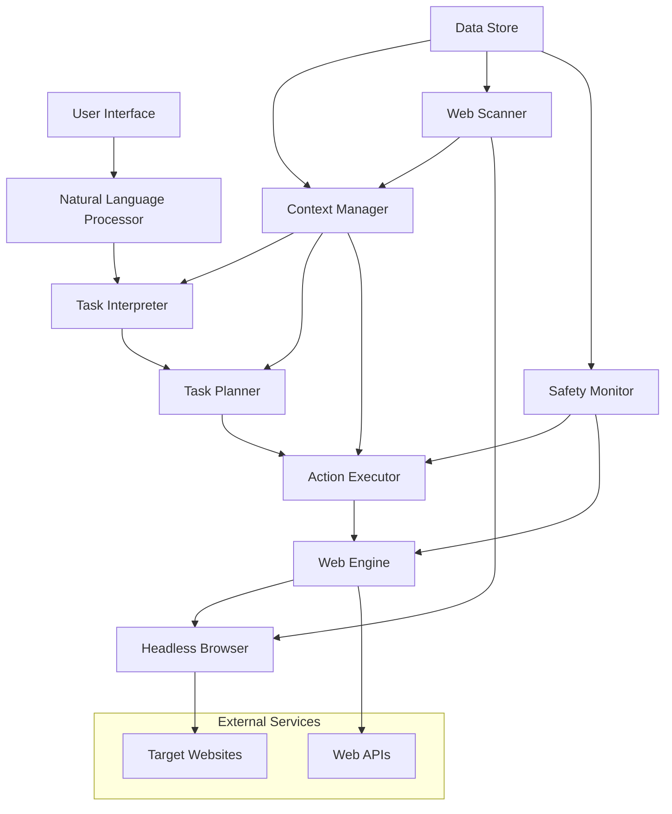

# AI Web Agent Design Document

## Overview

The AI Web Agent is an advanced automation system that transforms natural language instructions into executable web tasks. The system combines AI-powered intent recognition, web automation capabilities, real-time monitoring, and safety controls to create an intelligent agent that can perform complex web workflows autonomously.

The architecture follows a modular design with clear separation between intent processing, task execution, web interaction, and safety monitoring. The system is built to be extensible, secure, and capable of handling the dynamic nature of modern web applications.

## Architecture

### High-Level Architecture



### Component Architecture

The system is organized into several key layers:

1. **Interface Layer**: Handles user input and natural language processing
2. **Intelligence Layer**: Interprets tasks and creates execution plans
3. **Execution Layer**: Performs web interactions and automation
4. **Safety Layer**: Monitors and controls all web activities
5. **Data Layer**: Manages state, context, and persistent storage

## Components and Interfaces

### Natural Language Processor

**Purpose**: Converts user instructions into structured task representations

**Key Responsibilities**:
- Parse natural language commands
- Extract intent, entities, and parameters
- Handle ambiguous or incomplete instructions
- Support multi-step task descriptions

**Interface**:
```kotlin
interface NaturalLanguageProcessor {
    suspend fun parseCommand(input: String): TaskIntent
    suspend fun clarifyAmbiguity(intent: TaskIntent, context: UserContext): List<ClarificationQuestion>
    suspend fun extractEntities(input: String): List<Entity>
}

data class TaskIntent(
    val action: ActionType,
    val target: String?,
    val parameters: Map<String, Any>,
    val confidence: Float,
    val ambiguities: List<Ambiguity>
)
```

### Task Interpreter

**Purpose**: Converts task intents into executable action sequences

**Key Responsibilities**:
- Map intents to specific web actions
- Resolve dependencies between actions
- Handle conditional logic and branching
- Validate task feasibility

**Interface**:
```kotlin
interface TaskInterpreter {
    suspend fun interpretTask(intent: TaskIntent, context: WebContext): TaskPlan
    suspend fun validatePlan(plan: TaskPlan): ValidationResult
    suspend fun adaptPlan(plan: TaskPlan, newContext: WebContext): TaskPlan
}

data class TaskPlan(
    val steps: List<ActionStep>,
    val conditions: List<Condition>,
    val fallbacks: List<FallbackAction>,
    val estimatedDuration: Duration
)
```

### Action Executor

**Purpose**: Executes web actions and manages automation workflows

**Key Responsibilities**:
- Execute individual web actions (click, type, navigate)
- Handle dynamic content and JavaScript interactions
- Manage action timing and synchronization
- Implement retry logic and error recovery

**Interface**:
```kotlin
interface ActionExecutor {
    suspend fun executeAction(action: WebAction): ActionResult
    suspend fun executeSequence(actions: List<WebAction>): SequenceResult
    suspend fun waitForCondition(condition: WebCondition, timeout: Duration): Boolean
    suspend fun captureState(): WebState
}

sealed class WebAction {
    data class Click(val selector: String, val coordinates: Point? = null) : WebAction()
    data class Type(val selector: String, val text: String, val clear: Boolean = true) : WebAction()
    data class Navigate(val url: String) : WebAction()
    data class Scroll(val direction: ScrollDirection, val amount: Int) : WebAction()
    data class Upload(val selector: String, val filePath: String) : WebAction()
    data class Select(val selector: String, val option: String) : WebAction()
}
```

### Web Engine

**Purpose**: Provides low-level web interaction capabilities

**Key Responsibilities**:
- Manage headless browser instances
- Handle page loading and rendering
- Execute JavaScript and interact with DOM
- Capture screenshots and page content

**Interface**:
```kotlin
interface WebEngine {
    suspend fun createSession(): BrowserSession
    suspend fun navigateTo(url: String): NavigationResult
    suspend fun findElement(selector: String): WebElement?
    suspend fun findElements(selector: String): List<WebElement>
    suspend fun executeScript(script: String): Any?
    suspend fun captureScreenshot(): ByteArray
    suspend fun getPageContent(): String
}

interface WebElement {
    suspend fun click()
    suspend fun type(text: String)
    suspend fun getText(): String
    suspend fun getAttribute(name: String): String?
    suspend fun isVisible(): Boolean
    suspend fun isEnabled(): Boolean
}
```

### Web Scanner

**Purpose**: Monitors web content and detects changes in real-time

**Key Responsibilities**:
- Track content changes on monitored pages
- Extract structured data from web pages
- Detect price changes, availability updates
- Generate alerts and notifications

**Interface**:
```kotlin
interface WebScanner {
    suspend fun startMonitoring(config: MonitoringConfig): MonitoringSession
    suspend fun stopMonitoring(sessionId: String)
    suspend fun extractData(url: String, schema: ExtractionSchema): ExtractedData
    suspend fun detectChanges(url: String, baseline: PageSnapshot): List<Change>
}

data class MonitoringConfig(
    val url: String,
    val interval: Duration,
    val selectors: List<String>,
    val changeThreshold: Float,
    val alertConditions: List<AlertCondition>
)
```

### Context Manager

**Purpose**: Maintains awareness of current state and user goals

**Key Responsibilities**:
- Track current web session state
- Maintain user preferences and history
- Manage task context and dependencies
- Provide contextual information to other components

**Interface**:
```kotlin
interface ContextManager {
    suspend fun getCurrentContext(): WebContext
    suspend fun updateContext(update: ContextUpdate)
    suspend fun getUserPreferences(): UserPreferences
    suspend fun getTaskHistory(): List<CompletedTask>
    suspend fun predictNextAction(currentState: WebState): List<SuggestedAction>
}

data class WebContext(
    val currentUrl: String?,
    val pageTitle: String?,
    val availableActions: List<AvailableAction>,
    val formFields: List<FormField>,
    val userGoal: String?,
    val sessionData: Map<String, Any>
)
```

### Safety Monitor

**Purpose**: Ensures safe and ethical web interactions

**Key Responsibilities**:
- Validate actions against safety policies
- Monitor for suspicious or harmful activities
- Implement rate limiting and throttling
- Protect sensitive user data

**Interface**:
```kotlin
interface SafetyMonitor {
    suspend fun validateAction(action: WebAction, context: WebContext): ValidationResult
    suspend fun checkRateLimit(domain: String): RateLimitStatus
    suspend fun auditActivity(session: BrowserSession): AuditResult
    suspend fun encryptSensitiveData(data: String): EncryptedData
    suspend fun detectSuspiciousActivity(actions: List<WebAction>): List<SecurityAlert>
}

data class ValidationResult(
    val isAllowed: Boolean,
    val reason: String?,
    val suggestedAlternative: WebAction?
)
```

## Data Models

### Core Data Models

```kotlin
// Task and Intent Models
data class UserCommand(
    val id: String,
    val text: String,
    val timestamp: Instant,
    val userId: String,
    val context: Map<String, Any> = emptyMap()
)

data class TaskExecution(
    val id: String,
    val commandId: String,
    val plan: TaskPlan,
    val status: ExecutionStatus,
    val startTime: Instant,
    val endTime: Instant?,
    val results: List<ActionResult>,
    val errors: List<ExecutionError>
)

enum class ExecutionStatus {
    PENDING, RUNNING, COMPLETED, FAILED, CANCELLED
}

// Web Interaction Models
data class WebSession(
    val id: String,
    val browserType: BrowserType,
    val userAgent: String,
    val cookies: List<Cookie>,
    val localStorage: Map<String, String>,
    val sessionStorage: Map<String, String>
)

data class PageSnapshot(
    val url: String,
    val title: String,
    val content: String,
    val screenshot: ByteArray?,
    val timestamp: Instant,
    val metadata: Map<String, Any>
)

// Monitoring and Scanning Models
data class MonitoringSession(
    val id: String,
    val config: MonitoringConfig,
    val status: MonitoringStatus,
    val lastCheck: Instant?,
    val detectedChanges: List<Change>,
    val alerts: List<Alert>
)

data class Change(
    val type: ChangeType,
    val selector: String,
    val oldValue: String?,
    val newValue: String?,
    val timestamp: Instant,
    val confidence: Float
)

enum class ChangeType {
    TEXT_CHANGED, ELEMENT_ADDED, ELEMENT_REMOVED, ATTRIBUTE_CHANGED, PRICE_CHANGED
}

// User and Preference Models
data class UserProfile(
    val id: String,
    val preferences: UserPreferences,
    val credentials: Map<String, EncryptedCredential>,
    val personalData: PersonalData,
    val taskHistory: List<TaskExecution>
)

data class PersonalData(
    val name: String?,
    val email: String?,
    val phone: String?,
    val address: Address?,
    val paymentMethods: List<PaymentMethod>,
    val customFields: Map<String, String>
)

// Security and Safety Models
data class SecurityPolicy(
    val allowedDomains: List<String>,
    val blockedDomains: List<String>,
    val rateLimits: Map<String, RateLimit>,
    val sensitiveDataPatterns: List<Regex>,
    val requiredPermissions: List<Permission>
)

data class AuditLog(
    val id: String,
    val sessionId: String,
    val action: WebAction,
    val result: ActionResult,
    val timestamp: Instant,
    val riskLevel: RiskLevel,
    val metadata: Map<String, Any>
)
```

## Correctness Properties

*A property is a characteristic or behavior that should hold true across all valid executions of a system-essentially, a formal statement about what the system should do. Properties serve as the bridge between human-readable specifications and machine-verifiable correctness guarantees.*

<function_calls>
<invoke name="prework">
<parameter name="featureName">ai-web-agent
### P
roperty Reflection

After reviewing all identified properties, several can be consolidated to eliminate redundancy:

- Properties 1.1-1.5 all relate to task execution and can be combined into comprehensive task execution properties
- Properties 2.1-2.5 all relate to web scanning and can be consolidated into monitoring properties  
- Properties 3.1-3.4 all relate to form handling and can be combined into form automation properties
- Properties 15.1-15.5 all relate to safety and can be consolidated into security properties

Property 1: Natural language task interpretation
*For any* valid natural language command, the AI_Web_Agent should produce a valid execution plan that captures the user's intent
**Validates: Requirements 1.1**

Property 2: Complete task execution
*For any* valid task plan, the AI_Web_Agent should execute all required web actions and provide a summary of results
**Validates: Requirements 1.2, 1.4**

Property 3: Context preservation during execution
*For any* multi-step task, the AI_Web_Agent should maintain context consistency throughout the entire execution sequence
**Validates: Requirements 1.5**

Property 4: Adaptive obstacle handling
*For any* task execution that encounters obstacles, the AI_Web_Agent should find alternative approaches to complete the task
**Validates: Requirements 1.3**

Property 5: Real-time change detection
*For any* monitored web content, the Web_Scanner should detect and report changes within the specified monitoring interval
**Validates: Requirements 2.1, 2.5**

Property 6: Structured data extraction
*For any* web page, the Web_Scanner should extract structured data according to the provided schema
**Validates: Requirements 2.2**

Property 7: Concurrent monitoring capability
*For any* set of monitored websites, the Web_Scanner should track all sites simultaneously and generate alerts for detected changes
**Validates: Requirements 2.3**

Property 8: Trend analysis accuracy
*For any* time-series data collected by the Web_Scanner, the system should identify patterns and provide accurate insights
**Validates: Requirements 2.4**

Property 9: Form field analysis and filling
*For any* web form, the Action_Executor should correctly identify field types and fill them with appropriate user data
**Validates: Requirements 3.1**

Property 10: Multi-page form navigation
*For any* multi-page form workflow, the Action_Executor should navigate through all steps while maintaining data consistency
**Validates: Requirements 3.2**

Property 11: Dynamic form adaptation
*For any* form with changing requirements, the Action_Executor should adapt to new field requirements and validation rules
**Validates: Requirements 3.3**

Property 12: File upload matching
*For any* file upload requirement, the Action_Executor should select and upload appropriate documents based on form specifications
**Validates: Requirements 3.4**

Property 13: Safety compliance validation
*For any* web action, the Safety_Monitor should ensure compliance with website terms of service and safety policies
**Validates: Requirements 15.1**

Property 14: Sensitive data protection
*For any* sensitive user data, the Safety_Monitor should encrypt and protect the information according to security standards
**Validates: Requirements 15.2**

Property 15: Suspicious activity detection
*For any* sequence of web actions, the Safety_Monitor should detect suspicious patterns and halt operations when necessary
**Validates: Requirements 15.3**

Property 16: Secure authentication handling
*For any* account access requirement, the Safety_Monitor should use secure authentication methods and monitor for security breaches
**Validates: Requirements 15.4**

Property 17: Rate limit compliance
*For any* web interaction, the Safety_Monitor should respect rate limits and avoid overwhelming target servers
**Validates: Requirements 15.5**

## Error Handling

### Error Categories

**Network Errors**:
- Connection timeouts and failures
- DNS resolution issues
- SSL/TLS certificate problems
- Rate limiting responses

**Web Interaction Errors**:
- Element not found or not interactable
- JavaScript execution failures
- Page load timeouts
- Dynamic content loading issues

**Task Execution Errors**:
- Invalid or ambiguous user commands
- Impossible task requirements
- Missing required permissions or credentials
- External service unavailability

**Security Errors**:
- Suspicious activity detection
- Terms of service violations
- Authentication failures
- Data protection breaches

### Error Recovery Strategies

**Retry Logic**:
```kotlin
class RetryStrategy(
    val maxAttempts: Int = 3,
    val backoffStrategy: BackoffStrategy = ExponentialBackoff(),
    val retryableErrors: Set<ErrorType> = setOf(
        ErrorType.NETWORK_TIMEOUT,
        ErrorType.ELEMENT_NOT_READY,
        ErrorType.PAGE_LOADING
    )
)
```

**Fallback Actions**:
- Alternative element selectors
- Different interaction methods (keyboard vs mouse)
- Simplified task execution paths
- Manual intervention requests

**Graceful Degradation**:
- Partial task completion with user notification
- Alternative data sources when primary fails
- Reduced functionality modes
- Offline capability for cached operations

## Testing Strategy

### Dual Testing Approach

The AI Web Agent requires both unit testing and property-based testing to ensure comprehensive coverage:

**Unit Tests**:
- Verify specific web interaction scenarios
- Test error handling for known edge cases
- Validate security policy enforcement
- Check integration points between components

**Property-Based Tests**:
- Verify universal properties across all inputs using **fast-check** library
- Each property-based test will run a minimum of 100 iterations
- Tests will be tagged with comments referencing design document properties
- Format: `**Feature: ai-web-agent, Property {number}: {property_text}**`

**Property-Based Testing Library**: fast-check (JavaScript/TypeScript)
- Chosen for its robust generator system and shrinking capabilities
- Excellent support for complex data structure generation
- Strong integration with modern testing frameworks

**Testing Configuration**:
```typescript
// Property test configuration
const testConfig = {
  numRuns: 100, // Minimum iterations per property test
  timeout: 30000, // 30 second timeout for complex web operations
  seed: Math.random(), // Randomized seed for reproducibility
  shrinkOnFailure: true // Enable automatic test case shrinking
};
```

**Mock and Simulation Strategy**:
- Mock external websites for deterministic testing
- Simulate network conditions and failures
- Create test web pages with known structures
- Use headless browser instances for integration testing

**Security Testing**:
- Penetration testing for safety monitor
- Credential protection validation
- Rate limiting verification
- Terms of service compliance checking

### Integration Testing

**Browser Compatibility**:
- Test across multiple browser engines (Chromium, Firefox, WebKit)
- Verify JavaScript execution in different environments
- Test responsive design interactions

**Real Website Testing**:
- Controlled testing on sandbox websites
- Monitoring of public APIs with proper rate limiting
- Validation against known website structures

**Performance Testing**:
- Load testing for concurrent monitoring sessions
- Memory usage validation for long-running tasks
- Response time benchmarks for common operations

## Implementation Architecture

### Technology Stack

**Core Framework**: Kotlin/Android with Coroutines for async operations
**Web Automation**: Playwright or Selenium WebDriver for browser control
**AI/NLP**: Integration with OpenAI GPT or similar for natural language processing
**Database**: Room database for local storage, with encrypted sensitive data
**Networking**: Retrofit with OkHttp for API communications
**Security**: Android Keystore for credential management

### Deployment Considerations

**Resource Management**:
- Efficient browser instance pooling
- Memory management for long-running monitoring
- CPU optimization for concurrent operations

**Scalability**:
- Horizontal scaling for monitoring services
- Load balancing for high-volume operations
- Caching strategies for frequently accessed data

**Monitoring and Observability**:
- Comprehensive logging for all web interactions
- Performance metrics collection
- Error tracking and alerting
- User activity analytics (privacy-compliant)

### Security Architecture

**Data Protection**:
- End-to-end encryption for sensitive user data
- Secure credential storage using Android Keystore
- Regular security audits and vulnerability assessments

**Access Control**:
- Role-based permissions for different operation types
- User consent management for sensitive actions
- Audit trails for all automated activities

**Privacy Compliance**:
- GDPR and CCPA compliance measures
- User data anonymization options
- Clear data retention policies
- Transparent privacy controls