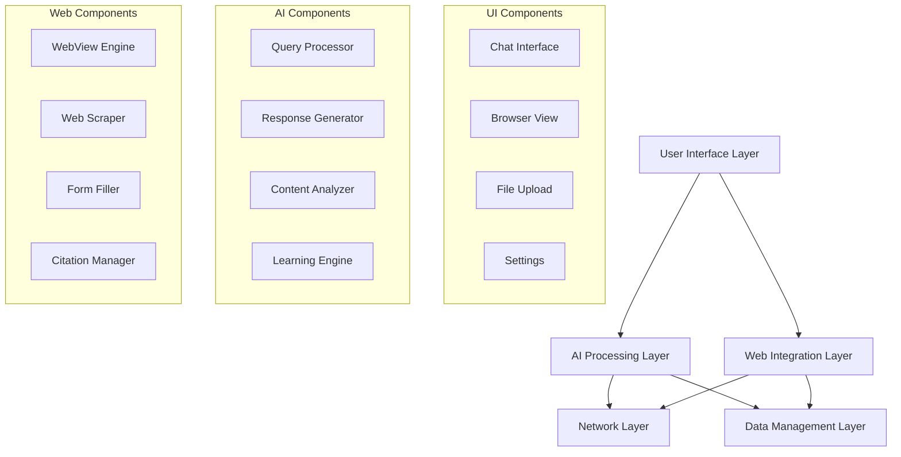

# Mobile Perplexity Comet - Design Document

## Overview

The Mobile Perplexity Comet application is a comprehensive Android app that replicates all functionality of Perplexity Comet. The system combines AI-powered conversational search, integrated web browsing, intelligent automation, and advanced content analysis in a unified mobile experience.

The architecture follows a modular design with clear separation between AI processing, web interaction, content analysis, and user interface components. The system prioritizes performance, reliability, and user experience while maintaining feature parity with the desktop Perplexity Comet.

## Architecture

### High-Level Architecture



### Component Architecture

The system is organized into distinct layers:

1. **Presentation Layer**: Android Activities, Fragments, and UI components
2. **Business Logic Layer**: AI processing, search coordination, and feature management
3. **Data Layer**: Local storage, caching, and data persistence
4. **Network Layer**: API communication, web scraping, and external integrations
5. **Integration Layer**: WebView management, form automation, and browser interaction

## Components and Interfaces

### Core Components

#### 1. AI Processing Engine
- **QueryProcessor**: Analyzes user input and determines appropriate response strategy
- **ResponseGenerator**: Coordinates AI model calls and formats responses
- **SearchCoordinator**: Manages different search modes (Academic, News, Reddit, etc.)
- **ContentAnalyzer**: Processes uploaded files, images, and documents
- **PersonalizationEngine**: Learns user preferences and adapts responses

#### 2. Web Integration System
- **BrowserManager**: Controls integrated WebView and browser functionality
- **WebScraper**: Extracts content from web pages in real-time
- **FormAutomator**: Intelligent form detection and filling
- **CitationManager**: Handles source attribution and reference management
- **URLAnalyzer**: Processes and validates web addresses

#### 3. Conversation Management
- **ConversationManager**: Handles chat sessions, history, and context
- **MessageProcessor**: Formats and processes individual messages
- **SessionPersistence**: Saves and restores conversation state
- **ContextTracker**: Maintains conversation context across interactions

#### 4. File Processing System
- **FileUploadManager**: Handles file selection and upload
- **ImageAnalyzer**: Processes and analyzes visual content
- **DocumentProcessor**: Extracts text and metadata from documents
- **CodeAnalyzer**: Analyzes programming code and provides insights

#### 5. User Interface Components
- **MainActivity**: Primary activity coordinating all features
- **ChatFragment**: Conversation interface with message display
- **BrowserFragment**: Integrated web browser with AI integration
- **UploadFragment**: File upload and analysis interface
- **SettingsFragment**: User preferences and configuration

### Interface Definitions

```kotlin
interface AIProcessor {
    suspend fun processQuery(query: String, context: ConversationContext): AIResponse
    suspend fun analyzeContent(content: ContentInput): AnalysisResult
    fun setSearchMode(mode: SearchMode)
}

interface WebManager {
    fun loadUrl(url: String)
    fun getCurrentPageContent(): PageContent
    suspend fun fillForm(formData: FormData): FormFillResult
    fun extractCitations(): List<Citation>
}

interface ConversationRepository {
    suspend fun saveMessage(message: Message)
    suspend fun getConversationHistory(conversationId: String): List<Message>
    suspend fun createNewConversation(): String
    suspend fun deleteConversation(conversationId: String)
}
```

## Data Models

### Core Data Models

```kotlin
data class Message(
    val id: String,
    val conversationId: String,
    val content: String,
    val type: MessageType,
    val timestamp: Long,
    val sources: List<Citation>,
    val attachments: List<Attachment>
)

data class ConversationContext(
    val conversationId: String,
    val messages: List<Message>,
    val searchMode: SearchMode,
    val userPreferences: UserPreferences
)

data class AIResponse(
    val content: String,
    val sources: List<Citation>,
    val confidence: Float,
    val searchResults: List<SearchResult>,
    val suggestions: List<String>
)

data class Citation(
    val title: String,
    val url: String,
    val author: String?,
    val publishDate: String?,
    val credibilityScore: Float,
    val snippet: String
)

data class FormData(
    val name: String?,
    val email: String?,
    val phone: String?,
    val address: String?,
    val dateOfBirth: String?,
    val customFields: Map<String, String>
)

data class FileAnalysis(
    val fileType: FileType,
    val content: String,
    val metadata: Map<String, Any>,
    val insights: List<String>,
    val extractedData: Any?
)
```

### Search and Content Models

```kotlin
enum class SearchMode {
    GENERAL, ACADEMIC, NEWS, REDDIT, YOUTUBE, CODE, MATH
}

enum class MessageType {
    USER_TEXT, USER_FILE, AI_RESPONSE, SYSTEM, ERROR
}

enum class FileType {
    IMAGE, DOCUMENT, CODE, PDF, SPREADSHEET, PRESENTATION
}

data class SearchResult(
    val title: String,
    val url: String,
    val snippet: String,
    val relevanceScore: Float,
    val source: String,
    val timestamp: Long?
)
```

Now I need to complete the prework analysis before writing the Correctness Properties section.

<function_calls>
<invoke name="prework">
<parameter name="featureName">mobile-perplexity-comet
## C
orrectness Properties

*A property is a characteristic or behavior that should hold true across all valid executions of a system-essentially, a formal statement about what the system should do. Properties serve as the bridge between human-readable specifications and machine-verifiable correctness guarantees.*

### Property Reflection

After analyzing all acceptance criteria, several properties can be consolidated to eliminate redundancy:

- **Form filling properties (4.2, 4.3)** can be combined into a single comprehensive field matching property
- **Search mode properties (9.2, 9.3, 9.4)** can be unified into one mode-specific behavior property  
- **Citation properties (13.1, 13.4, 13.5)** can be consolidated into comprehensive citation management
- **Persistence properties (2.1, 2.4)** represent the same round-trip behavior and can be combined
- **Content analysis properties (8.1, 8.2, 8.3, 8.5)** can be unified into file processing behavior

### Core Properties

**Property 1: Query Processing Completeness**
*For any* valid user query, the system should always return a comprehensive AI response with content
**Validates: Requirements 1.1**

**Property 2: Response Source Integration**
*For any* query response, if web search is available, the response should include search results and source citations
**Validates: Requirements 1.2, 1.3**

**Property 3: Response Streaming Behavior**
*For any* query processing, responses should be delivered incrementally rather than as a single complete response
**Validates: Requirements 1.4**

**Property 4: Citation Navigation**
*For any* response containing citations, clicking citation links should trigger proper browser navigation to the source
**Validates: Requirements 1.5, 3.1**

**Property 5: Conversation Persistence Round-trip**
*For any* conversation data, saving then restarting the app should restore the same conversation content
**Validates: Requirements 2.1, 2.4**

**Property 6: Context Preservation**
*For any* conversation with multiple messages, later messages should maintain reference to earlier conversation context
**Validates: Requirements 2.2**

**Property 7: Conversation Management Operations**
*For any* conversation, create/save/delete/rename operations should work correctly and be reflected in the conversation list
**Validates: Requirements 2.3, 2.5**

**Property 8: Browser-AI Integration**
*For any* web page loaded in the browser, users should be able to ask questions about the current page content
**Validates: Requirements 3.2**

**Property 9: Mode State Preservation**
*For any* application state, switching between chat and browser modes should preserve both states without data loss
**Validates: Requirements 3.3**

**Property 10: Browser Functionality**
*For any* web page, the browser should provide standard controls (back, forward, refresh, URL bar) that function correctly
**Validates: Requirements 3.4**

**Property 11: JavaScript Support**
*For any* JavaScript-heavy web page, the browser should load and execute JavaScript correctly
**Validates: Requirements 3.5, 11.3**

**Property 12: Form Detection**
*For any* web page containing forms, the system should automatically detect fillable form fields
**Validates: Requirements 4.1**

**Property 13: Intelligent Field Matching**
*For any* form filling request, user data should only be filled into fields that match the data type (email to email fields, phone to phone fields)
**Validates: Requirements 4.2, 4.3**

**Property 14: Form Review Capability**
*For any* completed form filling, users should be able to review and modify filled data before submission
**Validates: Requirements 4.4**

**Property 15: Current Page Form Filling**
*For any* form filling request, the operation should work on the currently displayed page without causing navigation
**Validates: Requirements 4.5**

**Property 16: Mode Navigation**
*For any* mode switching operation, clear navigation should be available between chat and browser views
**Validates: Requirements 5.2**

**Property 17: Responsive Layout**
*For any* screen size and orientation, layouts should adapt and remain functional
**Validates: Requirements 5.3**

**Property 18: UI Feedback**
*For any* user action, the interface should provide immediate visual feedback
**Validates: Requirements 5.4**

**Property 19: Multi-source Search**
*For any* search query, results should include content from multiple reliable web sources
**Validates: Requirements 6.1**

**Property 20: Source Recency Priority**
*For any* search results with timestamps, newer sources should be ranked higher than older sources with similar relevance
**Validates: Requirements 6.2**

**Property 21: Content Attribution**
*For any* response, AI-generated content should be clearly distinguished from source material
**Validates: Requirements 6.3**

**Property 22: Error Resilience**
*For any* unavailable sources or API failures, the system should handle errors gracefully without breaking functionality
**Validates: Requirements 6.4, 16.2, 16.3**

**Property 23: Result Ranking**
*For any* search results, they should be ordered by relevance and reliability scores
**Validates: Requirements 6.5**

**Property 24: Progressive Loading**
*For any* web page loading, content should display progressively without blocking the user interface
**Validates: Requirements 7.3**

**Property 25: Concurrent Operations**
*For any* multiple simultaneous requests, the system should handle them efficiently without conflicts
**Validates: Requirements 7.5**

**Property 26: File Analysis Processing**
*For any* uploaded file (image, document, code), the system should analyze the content and provide appropriate insights
**Validates: Requirements 8.1, 8.2, 8.3, 8.5**

**Property 27: Search Mode Availability**
*For any* search interface, Academic, News, Reddit, YouTube, and general web search modes should be available
**Validates: Requirements 9.1**

**Property 28: Mode-Specific Behavior**
*For any* specialized search mode, the system should adapt response formatting and source selection according to the mode type
**Validates: Requirements 9.2, 9.3, 9.4**

**Property 29: Context Preservation Across Modes**
*For any* mode switching, conversation context should be maintained while search behavior adapts
**Validates: Requirements 9.5**

**Property 30: Mathematical Computation**
*For any* mathematical question, the system should solve equations and provide step-by-step solutions
**Validates: Requirements 10.1**

**Property 31: Code Generation Correctness**
*For any* code generation request, the produced code should be syntactically correct for the specified programming language
**Validates: Requirements 10.2**

**Property 32: LaTeX Rendering**
*For any* mathematical expression containing LaTeX, it should render correctly in the interface
**Validates: Requirements 10.3**

**Property 33: Code Debugging**
*For any* buggy code input, the system should identify errors and suggest appropriate fixes
**Validates: Requirements 10.4**

**Property 34: Data Analysis**
*For any* data input, the system should perform statistical analysis and provide meaningful insights
**Validates: Requirements 10.5**

**Property 35: Web Content Extraction**
*For any* accessible URL, the system should extract and summarize the page content
**Validates: Requirements 11.1**

**Property 36: Topic Monitoring**
*For any* monitored topic, the system should provide updates when changes occur across sources
**Validates: Requirements 11.2**

**Property 37: Data Structure Intelligence**
*For any* extracted data, the system should structure information intelligently and provide actionable insights
**Validates: Requirements 11.4**

**Property 38: Web Standards Compliance**
*For any* web access, the system should respect robots.txt and handle access limitations gracefully
**Validates: Requirements 11.5**

**Property 39: Multilingual Query Support**
*For any* query in a supported language, the system should respond appropriately in the user's preferred language
**Validates: Requirements 12.1**

**Property 40: Translation Functionality**
*For any* foreign language content, the system should provide translations and cultural context
**Validates: Requirements 12.2**

**Property 41: Multilingual Source Synthesis**
*For any* search involving sources in different languages, the system should synthesize information across languages
**Validates: Requirements 12.4**

**Property 42: Character Set Support**
*For any* text in right-to-left languages or various character sets, it should display correctly
**Validates: Requirements 12.5**

**Property 43: Citation Metadata Completeness**
*For any* citation, it should include publication dates, author information, and credibility indicators when available
**Validates: Requirements 13.1**

**Property 44: Source Management Operations**
*For any* source, users should be able to save, bookmark, and organize references successfully
**Validates: Requirements 13.2**

**Property 45: Fact-checking Cross-reference**
*For any* information with multiple sources, the system should cross-reference sources and highlight discrepancies
**Validates: Requirements 13.3**

**Property 46: Topic Exploration Suggestions**
*For any* topic exploration, the system should suggest related sources and follow-up questions
**Validates: Requirements 13.4**

**Property 47: Citation Export Formats**
*For any* citation export request, references should be formatted in standard academic formats (APA, MLA, Chicago)
**Validates: Requirements 13.5**

**Property 48: Preference Learning**
*For any* regular usage pattern, the system should adapt response styles based on user preferences over time
**Validates: Requirements 14.1**

**Property 49: Preference Configuration**
*For any* preference setting, changes should affect system behavior (search sources, response length, detail level)
**Validates: Requirements 14.2**

**Property 50: Usage Pattern Suggestions**
*For any* tracked usage pattern, the system should suggest relevant topics and proactive insights
**Validates: Requirements 14.3**

**Property 51: Data Management Controls**
*For any* user data, privacy controls and data export options should function correctly
**Validates: Requirements 14.4**

**Property 52: Conversation Sharing**
*For any* conversation sharing request, the system should generate shareable links with appropriate privacy controls
**Validates: Requirements 15.1**

**Property 53: Collaborative Access**
*For any* shared conversation, multiple users should be able to contribute and access the content
**Validates: Requirements 15.2**

**Property 54: Content Export Formats**
*For any* content export request, the system should support multiple formats (PDF, markdown, plain text)
**Validates: Requirements 15.3**

**Property 55: Citation Integrity in Sharing**
*For any* shared content, source attribution and citation integrity should be maintained
**Validates: Requirements 15.4**

**Property 56: Team Workspace Management**
*For any* team workspace, organization and access management features should function correctly
**Validates: Requirements 15.5**

**Property 57: Offline Graceful Handling**
*For any* network connectivity loss, the system should handle offline scenarios gracefully and inform users
**Validates: Requirements 16.1**

**Property 58: Connectivity Recovery**
*For any* restored network connectivity, the system should automatically resume normal operations
**Validates: Requirements 16.4**

**Property 59: Offline Content Access**
*For any* cached content, it should remain accessible when the system is offline
**Validates: Requirements 16.5**

## Error Handling

### Error Categories and Strategies

1. **Network Errors**
   - Connection timeouts and failures
   - API rate limiting and service unavailability
   - Automatic retry with exponential backoff
   - Graceful degradation to cached content

2. **Content Processing Errors**
   - Invalid file formats or corrupted uploads
   - Unsupported content types
   - Clear error messages with suggested alternatives
   - Fallback to basic text processing

3. **Browser Integration Errors**
   - JavaScript execution failures
   - Page loading timeouts
   - Form detection failures
   - Alternative content extraction methods

4. **AI Processing Errors**
   - Model unavailability or overload
   - Invalid query formats
   - Context length limitations
   - Fallback to simpler processing modes

### Error Recovery Mechanisms

- **Automatic Retry**: Failed operations retry up to 3 times with increasing delays
- **Circuit Breaker**: Temporarily disable failing services to prevent cascading failures
- **Graceful Degradation**: Provide reduced functionality when full features are unavailable
- **User Notification**: Clear, actionable error messages with suggested next steps
- **State Preservation**: Maintain user data and conversation state during error recovery

## Testing Strategy

### Dual Testing Approach

The system requires both unit testing and property-based testing for comprehensive coverage:

- **Unit tests** verify specific examples, edge cases, and error conditions
- **Property tests** verify universal properties that should hold across all inputs
- Together they provide comprehensive coverage: unit tests catch concrete bugs, property tests verify general correctness

### Property-Based Testing Framework

**Framework Selection**: We will use **Kotest Property Testing** for Kotlin Android development, which provides:
- Comprehensive property testing capabilities
- Integration with Android testing frameworks
- Support for custom generators and shrinking
- Minimum 100 iterations per property test for thorough validation

**Property Test Configuration**:
- Each property-based test will run a minimum of 100 iterations
- Tests will be tagged with comments explicitly referencing the correctness property
- Tag format: `**Feature: mobile-perplexity-comet, Property {number}: {property_text}**`
- Each correctness property will be implemented by a single property-based test

### Unit Testing Strategy

**Unit Testing Framework**: Standard Android testing with JUnit 4/5 and Espresso for UI testing

**Coverage Areas**:
- Individual component functionality
- Integration points between AI, web, and UI layers
- Specific error conditions and edge cases
- User interface interactions and state management
- File processing and content analysis workflows

**Test Organization**:
- Co-located test files using `.test.kt` suffix
- Separate test suites for different component layers
- Mock external dependencies (APIs, network calls)
- Test data factories for consistent test scenarios

### Integration Testing

- **End-to-End Workflows**: Complete user journeys from query to response
- **Cross-Component Integration**: AI-Browser, Form Filling, File Processing
- **Performance Testing**: Response times, memory usage, concurrent operations
- **Compatibility Testing**: Different Android versions and device configurations

### Testing Requirements Summary

1. **Property-based tests** must be written for universal properties using Kotest
2. **Unit tests** must cover specific examples and integration points
3. **Each property test** must run minimum 100 iterations
4. **Test tagging** must follow the specified format linking to design properties
5. **Test implementation** must occur close to feature implementation for early error detection
6. **No mocking** in property tests - tests must validate real functionality
7. **Comprehensive coverage** combining both testing approaches for maximum reliability